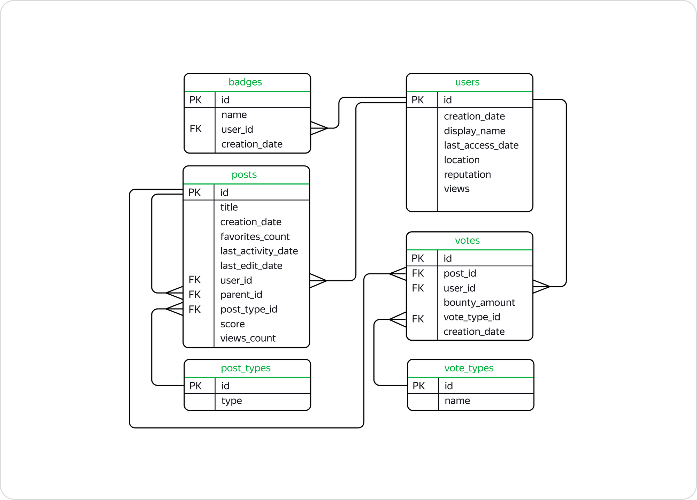

### Описание проекта.
В проекте мы будем работать с базой данных [StackOverflow](https://stackoverflow.com/) — сервиса вопросов и ответов о программировании. StackOverflow похож на социальную сеть — пользователи сервиса задают вопросы, отвечают на посты, оставляют комментарии и ставят оценки другим ответам. Нас интересует та часть информации в базе, где хранятся данные о постах за 2008 год, хотя в таблицах мы можем найти сведения и о более поздних оценках, которые эти посты получили.

### ER-диаграмма.

### Описание данных.
#### Таблица `stackoverflow.badges`

Хранит информацию о значках, которые присуждаются за разные достижения. Например, пользователь, правильно ответивший на большое количество вопросов про PostgreSQL, может получить значок postgresql.

|Поле|Описание|
|---|---|
|id|Идентификатор значка, первичный ключ таблицы|
|name|Название значка|
|user_id|Идентификатор пользователя, которому присвоили значок, внешний ключ, отсылающий к таблице `users`|
|creation_date|Дата присвоения значка|

#### Таблица `stackoverflow.post_types`

Содержит информацию о типе постов. Их может быть два:

- `Question` — пост с вопросом;
- `Answer` — пост с ответом.

|Поле|Описание|
|---|---|
|id|Идентификатор поста, первичный ключ таблицы|
|type|Тип поста

#### Таблица `stackoverflow.posts`

Содержит информацию о постах.

|Поле|Описание|
|---|---|
|id|Идентификатор поста, первичный ключ таблицы|
|title|Заголовок поста|
|creation_date|Дата создания поста|
|favorites_count|Число, которое показывает, сколько раз пост добавили в «Закладки»|
|last_activity_date|Дата последнего действия в посте, например комментария|
|last_edit_date|Дата последнего изменения поста|
|user_id|Идентификатор пользователя, который создал пост, внешний ключ к таблице `users`|
|parent_id|Если пост написали в ответ на другую публикацию, в это поле попадёт идентификатор поста с вопросом|
|post_type_id|Идентификатор типа поста, внешний ключ к таблице `post_types`|
|score|Количество очков, которое набрал пост|
|views_count|Количество просмотров|

#### Таблица `stackoverflow.users`

Содержит информацию о пользователях.

|Поле|Описание|
|---|---|
|id|Идентификатор пользователя, первичный ключ таблицы|
|creation_date|Дата регистрации пользователя|
|display_name|Имя пользователя|
|last_access_date|Дата последнего входа|
|location|Местоположение|
|reputation|Очки репутации, которые получают за хорошие вопросы и полезные ответы|
|views|Число просмотров профиля пользователя|

#### Таблица `stackoverflow.vote_types`

Содержит информацию о типах голосов. Голос — это метка, которую пользователи ставят посту. Типов бывает несколько:

- `UpMod` — такую отметку получают посты с вопросами или ответами, которые пользователи посчитали уместными и полезными.
- `DownMod` — такую отметку получают посты, которые показались пользователям наименее полезными.
- `Close` — такую метку ставят опытные пользователи сервиса, если заданный вопрос нужно доработать или он вообще не подходит для платформы.
- `Offensive` — такую метку могут поставить, если пользователь ответил на вопрос в грубой и оскорбительной манере, например, указав на неопытность автора поста.
- `Spam` — такую метку ставят в случае, если пост пользователя выглядит откровенной рекламой.

|Поле|Описание|
|---|---|
|id|Идентификатор типа голоса, первичный ключ|
|name|Название метки|

#### Таблица `stackoverflow.votes`

Содержит информацию о голосах за посты.

|Поле|Описание|
|---|---|
|id|Идентификатор голоса, первичный ключ|
|post_id|Идентификатор поста, внешний ключ к таблице `posts`|
|user_id|Идентификатор пользователя, который поставил посту голос, внешний ключ к таблице `users`|
|bounty_amount|Сумма вознаграждения, которое назначают, чтобы привлечь внимание к посту|
|vote_type_id|Идентификатор типа голоса, внешний ключ к таблице `vote_types`|
|creation_date|Дата назначения голоса|

### Задачи.

Задача 1.  
Найдите количество вопросов, которые набрали больше 300 очков или как минимум 100 раз были добавлены в «Закладки».

Задача 2.  
Сколько в среднем в день задавали вопросов с 1 по 18 ноября 2008 включительно? Результат округлите до целого числа.

Задача 3.  
Сколько пользователей получили значки сразу в день регистрации? Выведите количество уникальных пользователей.

Задача 4.  
Сколько уникальных постов пользователя с именем Joel Coehoorn получили хотя бы один голос?

Задача 5.  
Выгрузите все поля таблицы `vote_types`. Добавьте к таблице поле `rank`, в которое войдут номера записей в обратном порядке. Таблица должна быть отсортирована по полю `id`.

Задача 6.  
Отберите 10 пользователей, которые поставили больше всего голосов типа `Close`. Отобразите таблицу из двух полей: идентификатором пользователя и количеством голосов. Отсортируйте данные сначала по убыванию количества голосов, потом по убыванию значения идентификатора пользователя.

Задача 7.  
Отберите 10 пользователей по количеству значков, полученных в период с 15 ноября по 15 декабря 2008 года включительно. Отобразите несколько полей:

- идентификатор пользователя;
- число значков;
- место в рейтинге — чем больше значков, тем выше рейтинг.

Пользователям, которые набрали одинаковое количество значков, присвойте одно и то же место в рейтинге.

Отсортируйте записи по количеству значков по убыванию, а затем по возрастанию значения идентификатора пользователя.

Задача 8.  
Сколько в среднем очков получает пост каждого пользователя?

Сформируйте таблицу из следующих полей:

- заголовок поста;
- идентификатор пользователя;
- число очков поста;
- среднее число очков пользователя за пост, округлённое до целого числа.

Не учитывайте посты без заголовка, а также те, что набрали ноль очков.

Задача 9.  
Отобразите заголовки постов, которые были написаны пользователями, получившими более 1000 значков. Посты без заголовков не должны попасть в список.

Задача 10.  
Напишите запрос, который выгрузит данные о пользователях из Канады (англ. Canada). Разделите пользователей на три группы в зависимости от количества просмотров их профилей:

- пользователям с числом просмотров больше либо равным 350 присвойте группу `1`;
- пользователям с числом просмотров меньше 350, но больше либо равно 100 — группу `2`;
- пользователям с числом просмотров меньше 100 — группу `3`.

Отобразите в итоговой таблице идентификатор пользователя, количество просмотров профиля и группу. Пользователи с количеством просмотров меньше либо равным нулю не должны войти в итоговую таблицу.

Задача 11.  
Дополните предыдущий запрос. Отобразите лидеров каждой группы — пользователей, которые набрали максимальное число просмотров в своей группе. Выведите поля с идентификатором пользователя, группой и количеством просмотров. Отсортируйте таблицу по убыванию просмотров, а затем по возрастанию значения идентификатора.

Задача 12.  
Посчитайте ежедневный прирост новых пользователей в ноябре 2008 года. Сформируйте таблицу с полями:

- номер дня;
- число пользователей, зарегистрированных в этот день;
- сумму пользователей с накоплением.

Задача 13.  
Для каждого пользователя, который написал хотя бы один пост, найдите интервал между регистрацией и временем создания первого поста. Отобразите:

- идентификатор пользователя;
- разницу во времени между регистрацией и первым постом.

Задача 14.  
Выведите общую сумму просмотров у постов, опубликованных в каждый месяц 2008 года. Если данных за какой-либо месяц в базе нет, такой месяц можно пропустить. Результат отсортируйте по убыванию общего количества просмотров.

Задача 15.  
Выведите имена самых активных пользователей, которые в первый месяц после регистрации (включая день регистрации) дали больше 100 ответов. Вопросы, которые задавали пользователи, не учитывайте. Для каждого имени пользователя выведите количество уникальных значений `user_id`. Отсортируйте результат по полю с именами в лексикографическом порядке.

Задача 16.  
Выведите количество постов за 2008 год по месяцам. Отберите посты от пользователей, которые зарегистрировались в сентябре 2008 года и сделали хотя бы один пост в декабре того же года. Отсортируйте таблицу по значению месяца по убыванию.

Задача 17.  
Используя данные о постах, выведите несколько полей:

- идентификатор пользователя, который написал пост;
- дата создания поста;
- количество просмотров у текущего поста;
- сумма просмотров постов автора с накоплением.

Данные в таблице должны быть отсортированы по возрастанию идентификаторов пользователей, а данные об одном и том же пользователе — по возрастанию даты создания поста.

Задача 18.  
Сколько в среднем дней в период с 1 по 7 декабря 2008 года включительно пользователи взаимодействовали с платформой? Для каждого пользователя отберите дни, в которые он или она опубликовали хотя бы один пост. Нужно получить одно целое число — не забудьте округлить результат.

Задача 19.  
На сколько процентов менялось количество постов ежемесячно с 1 сентября по 31 декабря 2008 года? Отобразите таблицу со следующими полями:

- Номер месяца.
- Количество постов за месяц.
- Процент, который показывает, насколько изменилось количество постов в текущем месяце по сравнению с предыдущим.

Если постов стало меньше, значение процента должно быть отрицательным, если больше — положительным. Округлите значение процента до двух знаков после запятой.

Напомним, что при делении одного целого числа на другое в PostgreSQL в результате получится целое число, округлённое до ближайшего целого вниз. Чтобы этого избежать, переведите делимое в тип `numeric`.

Задача 20.  
Найдите пользователя, который опубликовал больше всего постов за всё время с момента регистрации. Выведите данные его активности за октябрь 2008 года в таком виде:

- номер недели;
- дата и время последнего поста, опубликованного на этой неделе.