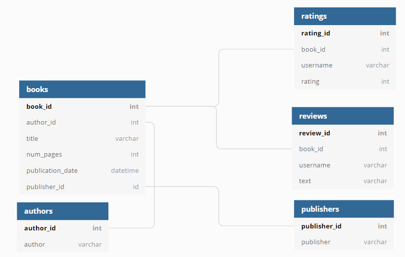

### Цель исследования

Наша компания работает над улучшением сервиса для чтения книг по подписке и у нас в распоряжении есть БД сервиса.  
Необходимо ознакомиться и проанализировать БД.  
Результаты помогут сформулировать ценностное предложение для нового продукта.  

### Описание данных

**Таблица `books`**

Содержит данные о книгах:

- `book_id` — идентификатор книги;
- `author_id` — идентификатор автора;
- `title` — название книги;
- `num_pages` — количество страниц;
- `publication_date` — дата публикации книги;
- `publisher_id` — идентификатор издателя.

**Таблица `authors`**

Содержит данные об авторах:

- `author_id` — идентификатор автора;
- `author` — имя автора.

**Таблица `publishers`**

Содержит данные об издательствах:

- `publisher_id` — идентификатор издательства;
- `publisher` — название издательства;

**Таблица `ratings`**

Содержит данные о пользовательских оценках книг:

- `rating_id` — идентификатор оценки;
- `book_id` — идентификатор книги;
- `username` — имя пользователя, оставившего оценку;
- `rating` — оценка книги.

**Таблица `reviews`**

Содержит данные о пользовательских обзорах:

- `review_id` — идентификатор обзора;
- `book_id` — идентификатор книги;
- `username` — имя автора обзора;
- `text` — текст обзора.

### Рекомендации для бизнеса
1. Современные книги: Учитывая, что после 1 января 2000 года вышло 819 книг, стоит обратить внимание на современные книги. Они могут привлечь больше читателей, так как они отражают актуальные темы и тенденции. 
2. Популярные книги: Книга “Twilight” имеет наибольшее количество обзоров (7 обзоров). Это указывает на ее популярность среди читателей. Предлагая такие книги, вы можете привлечь больше читателей.  
3. Издательства с хорошей репутацией: “Penguin Books” выпустило наибольшее число книг (42 книги). Сотрудничество с издательствами, которые имеют хорошую репутацию и выпускают большое количество книг, может увеличить доверие читателей.
4. Авторы с высокими оценками: “J.K. Rowling/Mary GrandPré” - авторы с самой высокой средней оценкой (4.28). Предлагая книги от авторов с высокими оценками, вы можете увеличить удовлетворенность читателей.  
5. Активные пользователи: Среднее количество обзоров от пользователей, которые поставили больше 48 оценок, составляет 24 обзора. Это показывает, что активные пользователи вносят значительный вклад в общее количество обзоров. Поощрение активных пользователей может помочь увеличить общее количество обзоров и оценок.  